# PawFinder 系统 Mermaid 图表集

> **版本**: v1.0  
> **最后更新**: 2025-01-13  
> **说明**: 本文档包含系统实现文档中所有图表的 Mermaid 代码版本，可在支持 Mermaid 的 Markdown 编辑器中渲染查看

---

## 目录

1. [系统架构图](#1-系统架构图)
2. [微服务调用关系图](#2-微服务调用关系图)
3. [用户登录时序图](#3-用户登录时序图)
4. [领养申请时序图](#4-领养申请时序图)
5. [支付流程时序图](#5-支付流程时序图)
6. [宠物领养完整流程图](#6-宠物领养完整流程图)
7. [宠物状态流转图](#7-宠物状态流转图)
8. [订单状态流转图](#8-订单状态流转图)
9. [核心实体类图](#9-核心实体类图)
10. [服务类图](#10-服务类图)
11. [数据库ER图](#11-数据库er图)
12. [Database per Service架构图](#12-database-per-service架构图)
13. [生产环境部署架构图](#13-生产环境部署架构图)
14. [负载均衡架构图](#14-负载均衡架构图)

---

## 1. 系统架构图

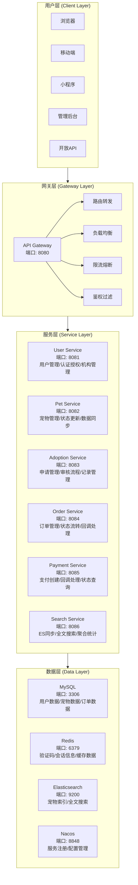

---

## 2. 微服务调用关系图

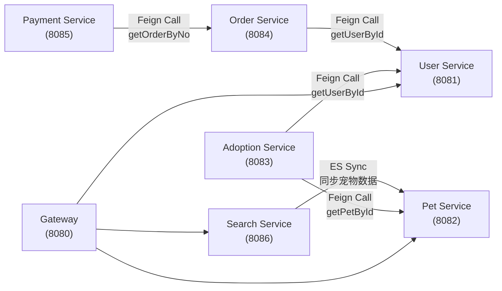

---

## 3. 用户登录时序图

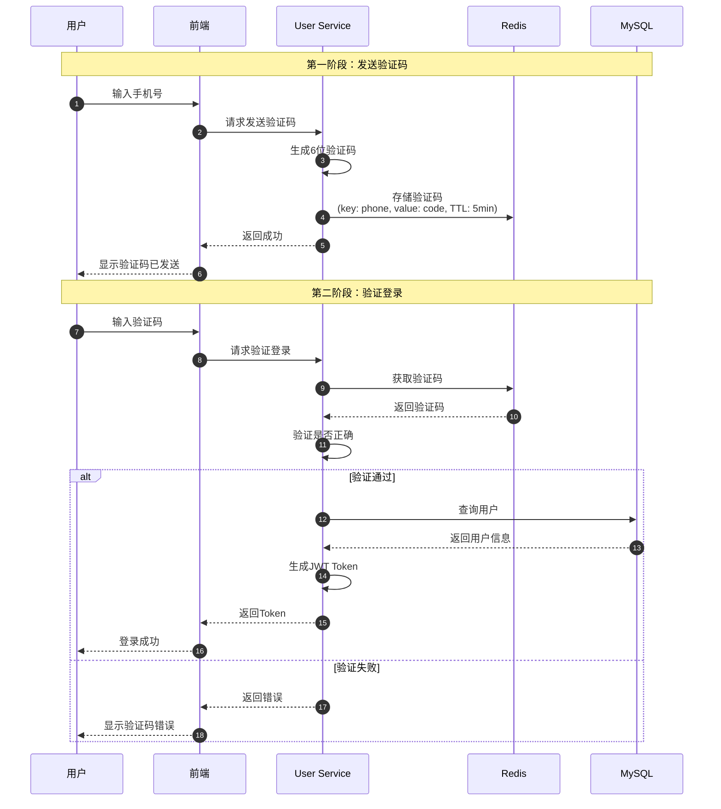

---

## 4. 领养申请时序图

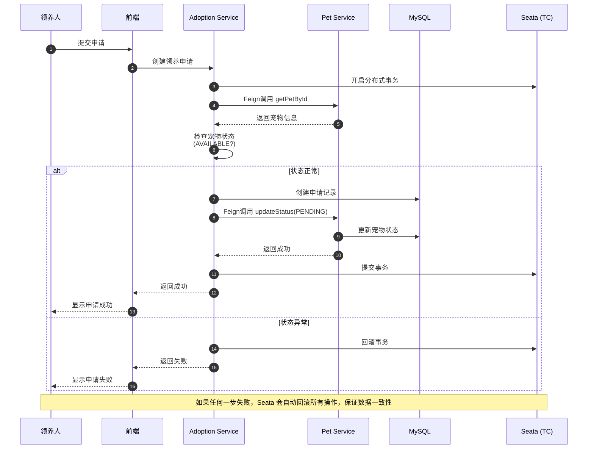

---

## 5. 支付流程时序图

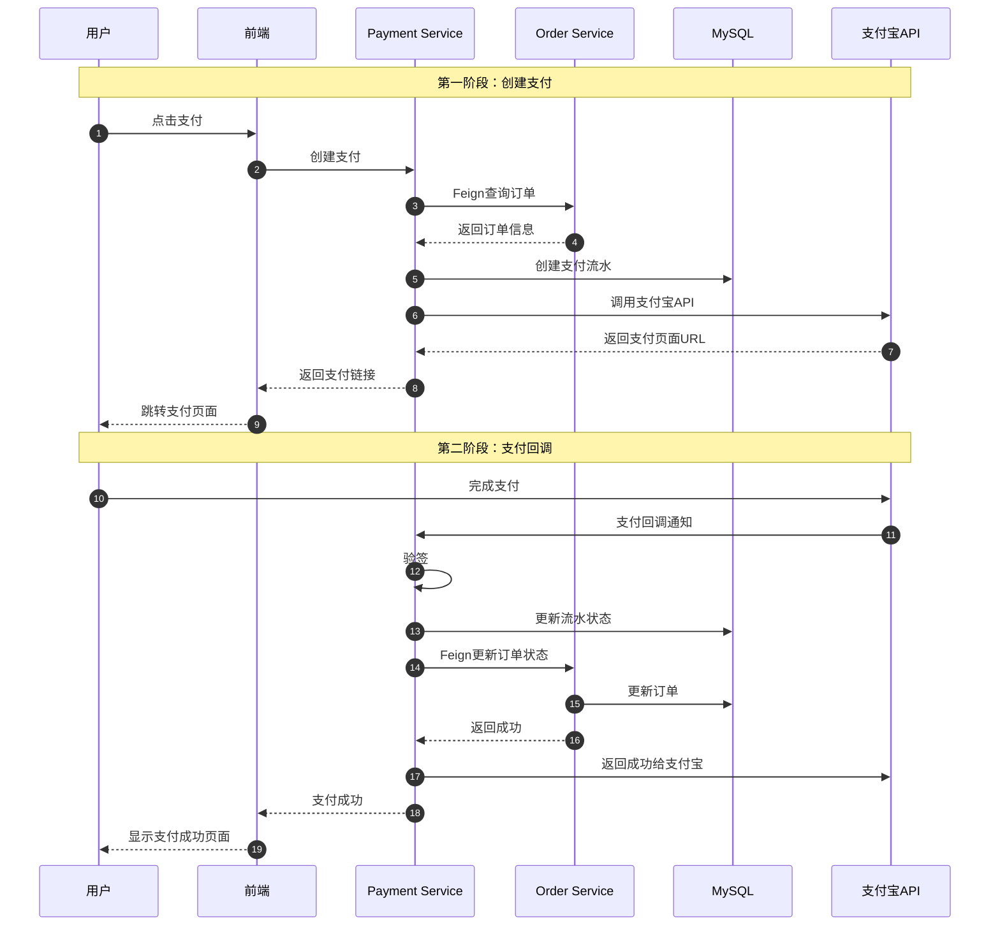

---

## 6. 宠物领养完整流程图

```mermaid
flowchart TD
    start([开始]) --> browse[浏览宠物列表<br/>搜索、筛选、查看]
    browse --> select[选择心仪宠物<br/>查看详情页面]
    select --> checkStatus{宠物状态<br/>是否可领养?}
    
    checkStatus -->|否| showUnavailable[显示暂不可领养]
    checkStatus -->|是| clickApply[点击申请领养]
    
    clickApply --> checkLogin{用户是否<br/>已登录?}
    checkLogin -->|否| login[跳转登录页面<br/>手机验证码登录]
    checkLogin -->|是| fillForm[填写领养申请表<br/>联系方式、居住环境等]
    
    fillForm --> submit[提交领养申请<br/>开启分布式事务]
    submit --> updateStatus[宠物状态改为待审核<br/>PENDING]
    updateStatus --> waitReview[等待机构审核]
    
    waitReview --> reviewResult{审核结果}
    reviewResult -->|通过| createOrder[创建领养订单<br/>宠物状态改为已预定]
    reviewResult -->|拒绝| restoreAvailable[宠物恢复可领养<br/>通知用户被拒绝]
    
    createOrder --> pay[用户支付押金<br/>支付宝支付]
    pay --> payResult{支付结果}
    
    payResult -->|成功| updateOrderPaid[订单状态改为已支付<br/>通知机构安排交接]
    payResult -->|失败| retryPay[提示用户重试支付<br/>或取消订单]
    
    updateOrderPaid --> handover[线下交接宠物<br/>机构确认交接完成]
    handover --> complete[宠物状态改为已领养<br/>订单状态改为已完成<br/>生成领养记录]
    complete --> end([结束])
    
    showUnavailable --> browse
    login --> fillForm
    retryPay --> pay
    restoreAvailable --> browse
```

---

## 7. 宠物状态流转图

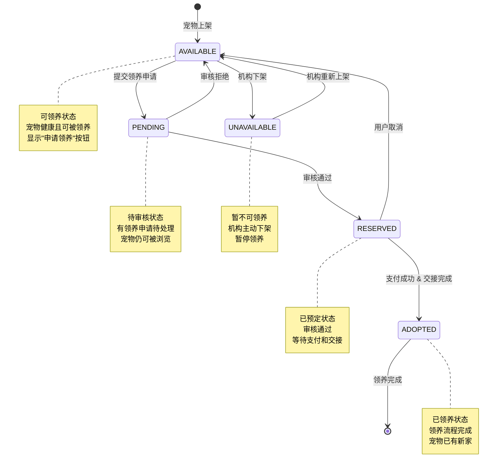

---

## 8. 订单状态流转图

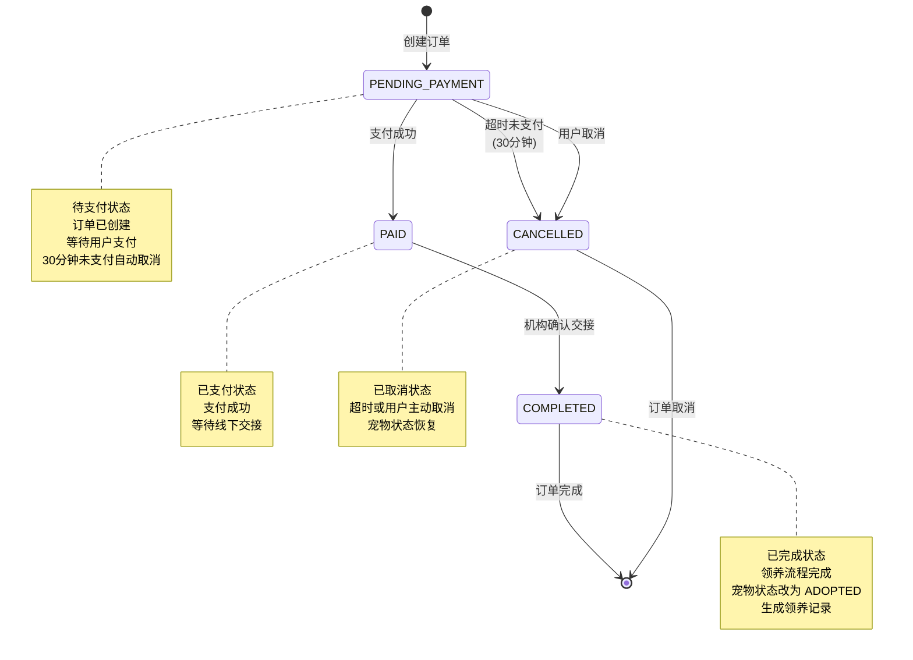

---

## 9. 核心实体类图

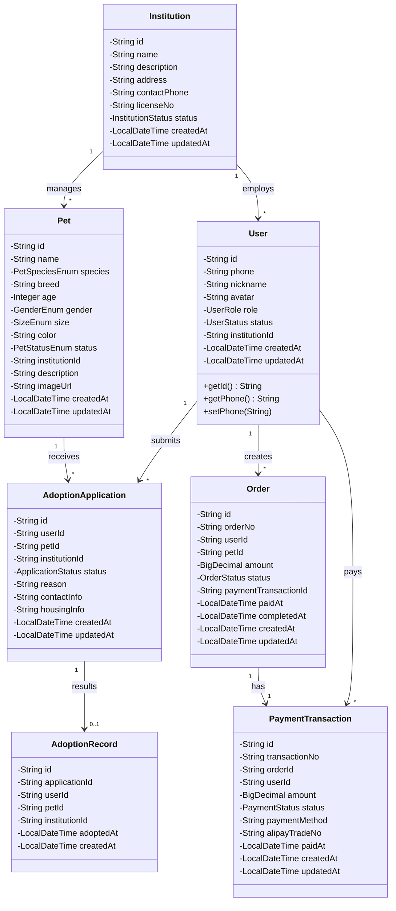

---

## 10. 服务类图

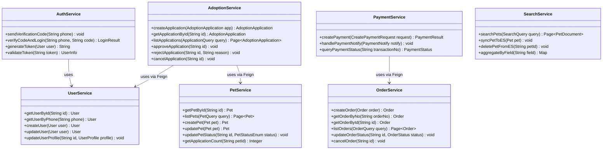

---

## 11. 数据库ER图

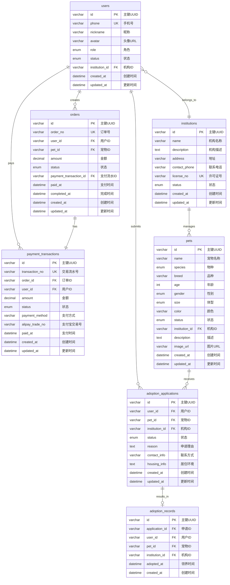

---

## 12. Database per Service架构图

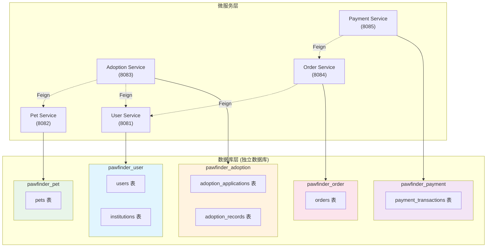

---

## 13. 生产环境部署架构图

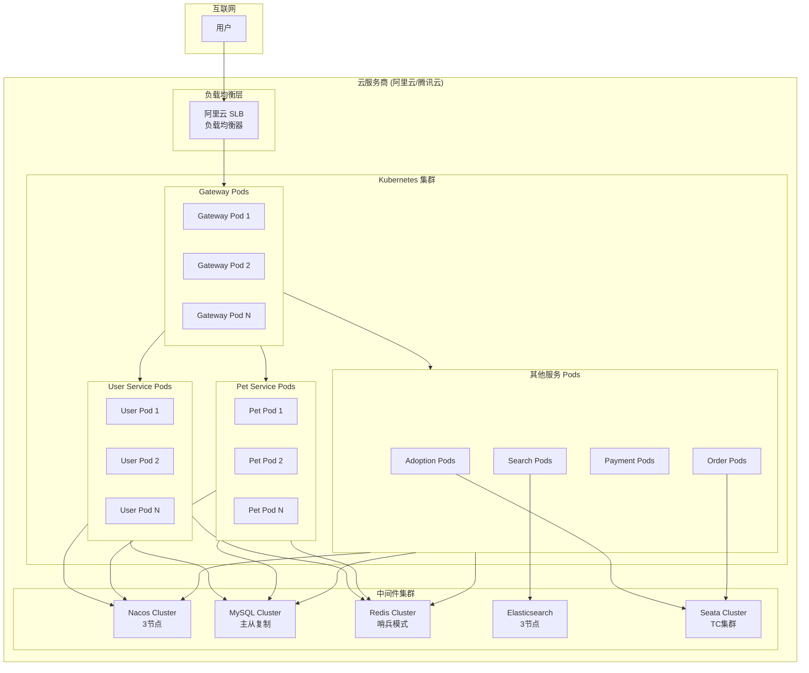

---

## 14. 负载均衡架构图

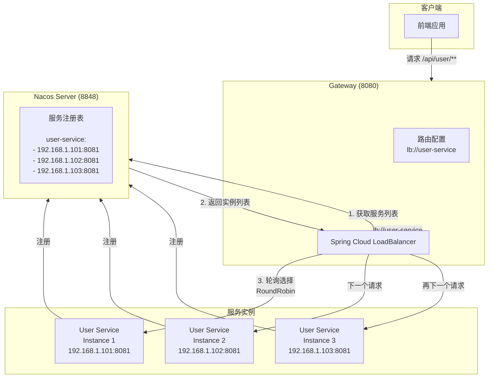

---

## 使用说明

### 如何渲染 Mermaid 图表

1. **VS Code**: 安装 `Markdown Preview Mermaid Support` 插件
2. **GitHub**: 直接在 Markdown 文件中使用，GitHub 原生支持
3. **Typora**: 原生支持 Mermaid 语法
4. **在线工具**: 
   - [Mermaid Live Editor](https://mermaid.live/)
   - [Mermaid Playground](https://mermaid-js.github.io/mermaid-live-editor/)

### 图表类型说明

| 图表类型 | Mermaid 语法 | 适用场景 |
|---------|-------------|---------|
| 流程图 | `flowchart` / `graph` | 业务流程、系统架构 |
| 时序图 | `sequenceDiagram` | 接口调用、请求响应流程 |
| 状态图 | `stateDiagram-v2` | 状态流转、生命周期 |
| 类图 | `classDiagram` | 类结构、实体关系 |
| ER图 | `erDiagram` | 数据库表关系 |

---

## 版本历史

| 版本 | 日期 | 说明 |
|------|------|------|
| v1.0 | 2025-01-13 | 初始版本，包含14张核心图表 |
