# PawFinder 未来规划文档

> 版本：v1.0  
> 更新时间：2025-01-13  
> 文档状态：规划中

---

## 目录

1. [文档概述](#1-文档概述)
2. [支付模块规划](#2-支付模块规划)
3. [人工智能助手模块规划](#3-人工智能助手模块规划)
4. [技术演进路线图](#4-技术演进路线图)
5. [风险评估与应对](#5-风险评估与应对)
6. [总结](#6-总结)

---

## 1. 文档概述

### 1.1 当前系统现状

PawFinder 宠物领养系统已完成基础架构搭建，实现了用户管理、宠物管理、领养申请、搜索等核心功能。本文档规划两大重要模块的未来发展方向。

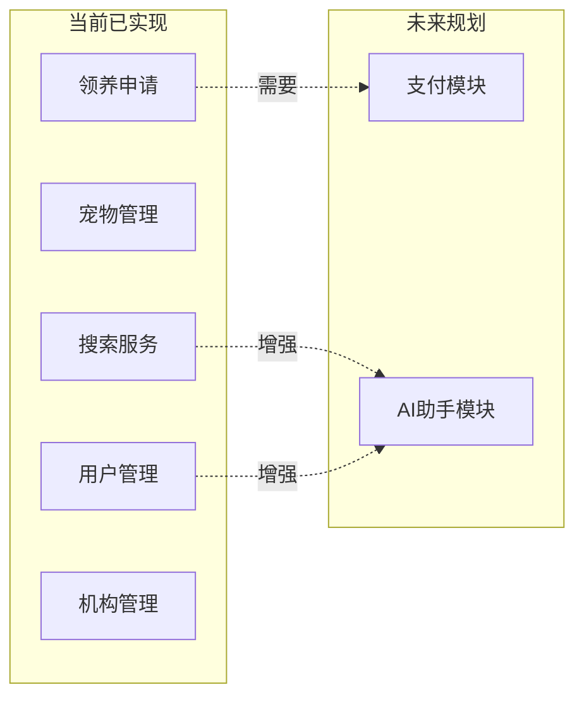

### 1.2 规划目标

| 模块 | 目标 | 预期价值 |
|------|------|---------|
| **支付模块** | 实现完整的支付闭环 | 支持领养费用支付、保证金、公益捐赠 |
| **AI助手模块** | 提供智能咨询服务 | 提升用户体验、降低人工客服成本 |

---

## 2. 支付模块规划

### 2.1 功能概览

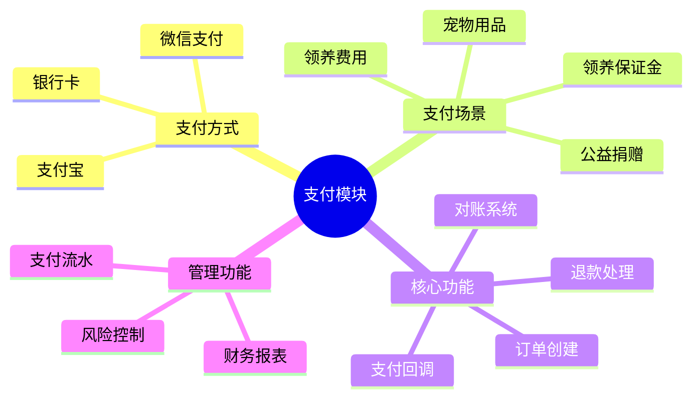

### 2.2 支付场景设计

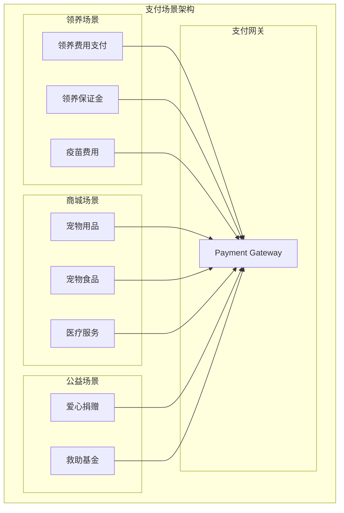

### 2.3 支付流程时序图

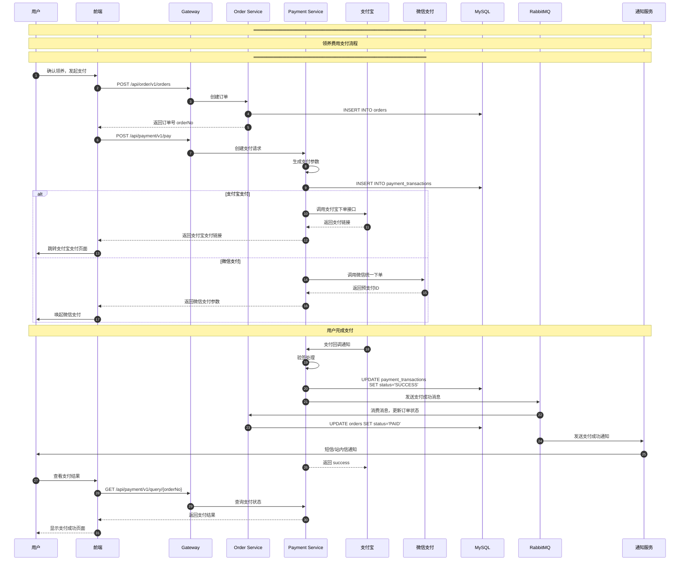

### 2.4 订单状态流转图

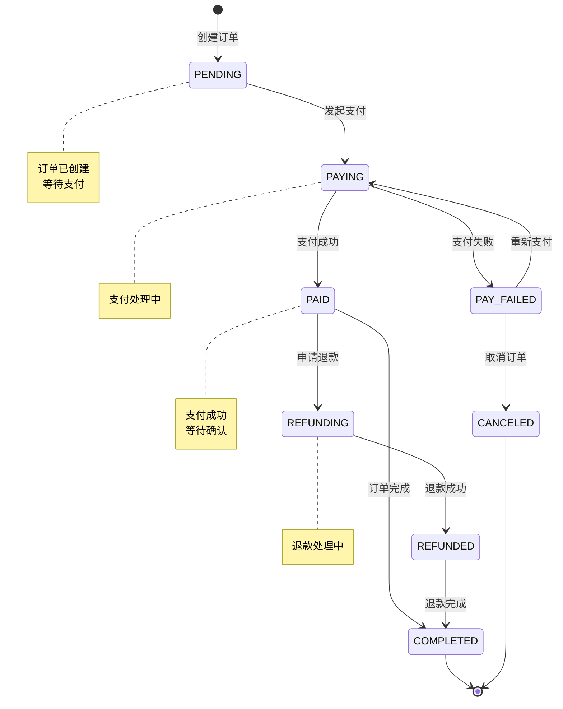

### 2.5 数据库设计

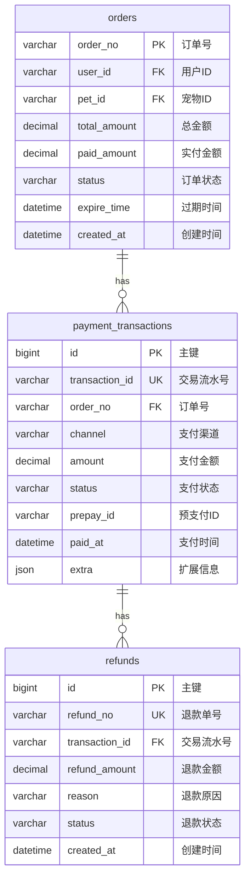

### 2.6 技术架构图

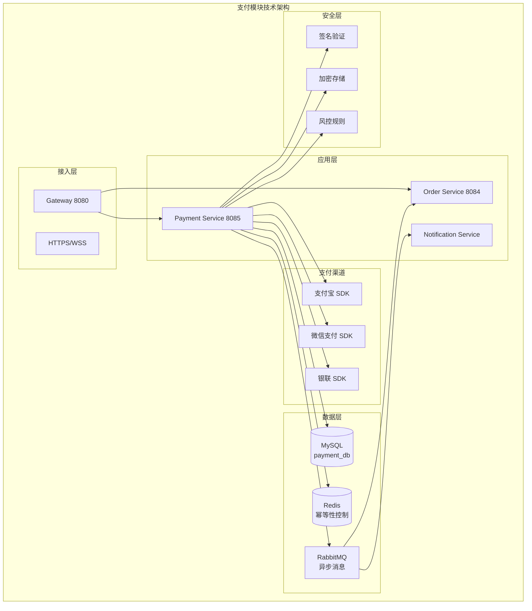

### 2.7 核心功能清单

| 功能模块 | 功能点 | 优先级 | 状态 |
|---------|--------|--------|------|
| **订单管理** | 创建订单 | P0 | ✅ 已实现 |
| | 订单查询 | P0 | ✅ 已实现 |
| | 订单取消 | P0 | ✅ 已实现 |
| | 订单超时处理 | P1 | 📋 规划中 |
| **支付处理** | 支付宝支付 | P0 | ⚠️ 部分实现 |
| | 微信支付 | P1 | 📋 规划中 |
| | 支付状态查询 | P0 | ✅ 已实现 |
| | 支付回调处理 | P0 | ✅ 已实现 |
| **退款管理** | 退款申请 | P1 | 📋 规划中 |
| | 退款查询 | P1 | 📋 规划中 |
| | 退款回调 | P1 | 📋 规划中 |
| **对账系统** | 每日对账 | P2 | 📋 规划中 |
| | 差错处理 | P2 | 📋 规划中 |
| **风控系统** | 频率限制 | P1 | 📋 规划中 |
| | 异常检测 | P2 | 📋 规划中 |

---

## 3. 人工智能助手模块规划

### 3.1 功能概览

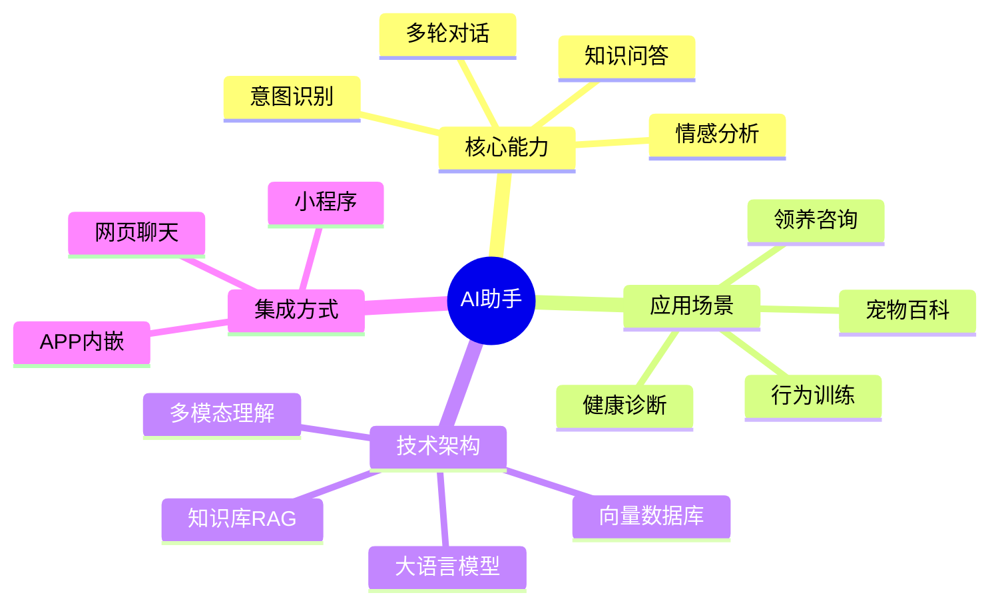

### 3.2 AI助手架构设计

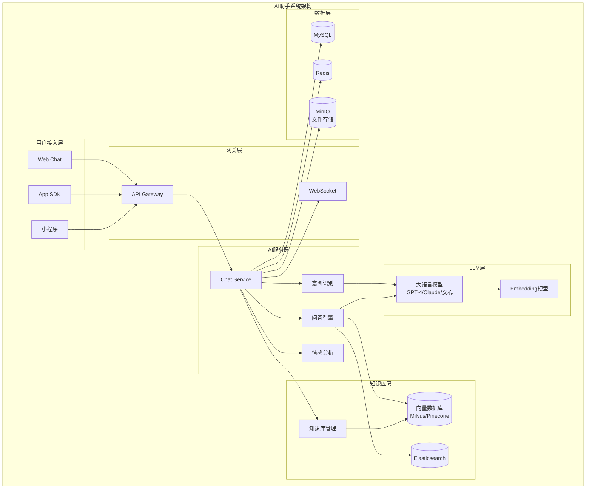

### 3.3 对话流程时序图

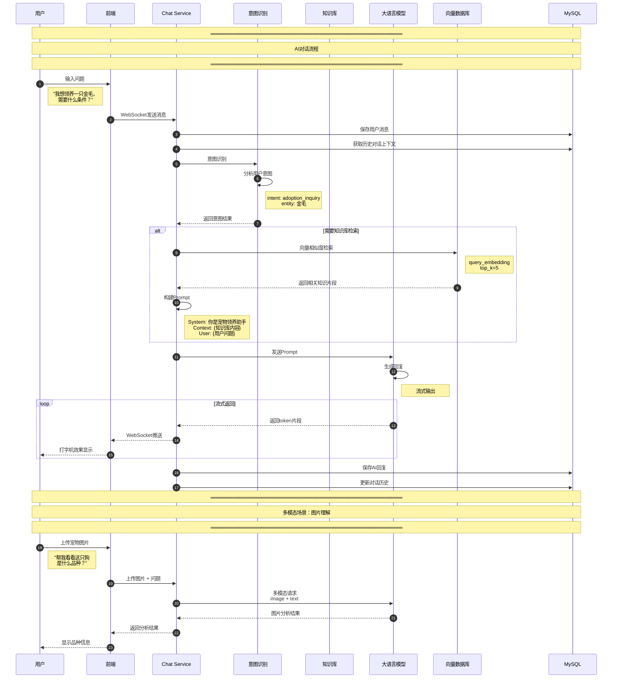

### 3.4 RAG知识库架构

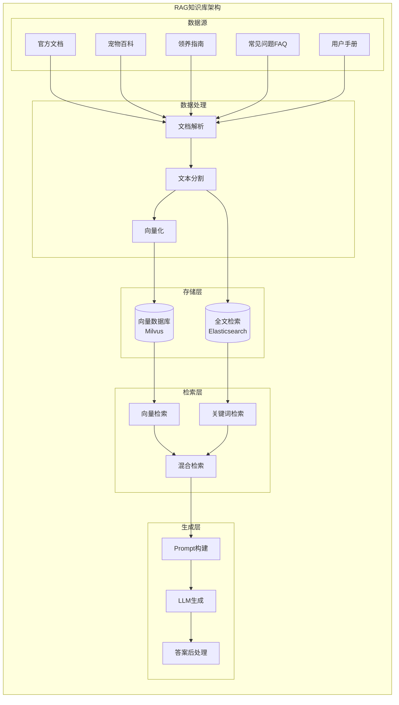

### 3.5 意图识别分类

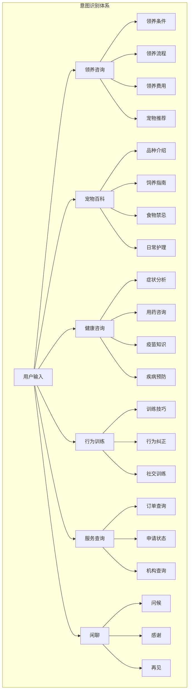

### 3.6 功能模块清单

| 模块 | 功能 | 描述 | 优先级 |
|------|------|------|--------|
| **对话管理** | 多轮对话 | 保持上下文连贯 | P0 |
| | 会话管理 | 创建、恢复、结束会话 | P0 |
| | 历史记录 | 对话历史存储和查询 | P1 |
| **意图理解** | 意图分类 | 识别用户真实需求 | P0 |
| | 实体抽取 | 提取关键信息（品种、症状等） | P0 |
| | 槽位填充 | 引导用户提供必要信息 | P1 |
| **知识问答** | FAQ问答 | 基于知识库的精准回答 | P0 |
| | 文档问答 | RAG检索增强生成 | P1 |
| | 多模态问答 | 图片+文字理解 | P2 |
| **智能推荐** | 宠物推荐 | 根据用户偏好推荐 | P1 |
| | 内容推荐 | 推荐相关文章/视频 | P2 |
| **情感分析** | 情绪识别 | 识别用户情绪状态 | P2 |
| | 智能回复 | 根据情绪调整回复风格 | P2 |

### 3.7 技术选型对比

| 技术领域 | 方案A | 方案B | 推荐 | 理由 |
|---------|-------|-------|------|------|
| **大语言模型** | OpenAI GPT-4 | 国产大模型（文心/通义） | 方案B | 国内合规、成本可控 |
| **向量数据库** | Milvus | Pinecone | Milvus | 开源、可私有部署 |
| **Embedding** | OpenAI Embedding | BGE/M3E | BGE | 中文效果更好 |
| **对话框架** | LangChain | 自研 | LangChain | 成熟稳定、生态丰富 |
| **流式输出** | SSE | WebSocket | WebSocket | 双向通信、实时性强 |

---

## 4. 技术演进路线图

### 4.1 整体规划时间线

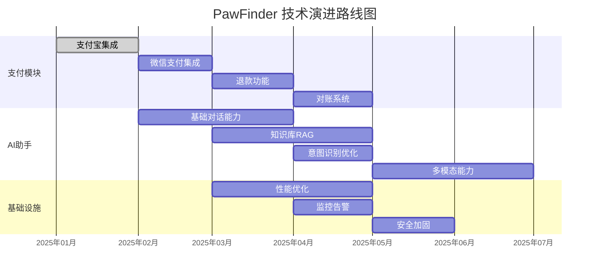

### 4.2 版本规划

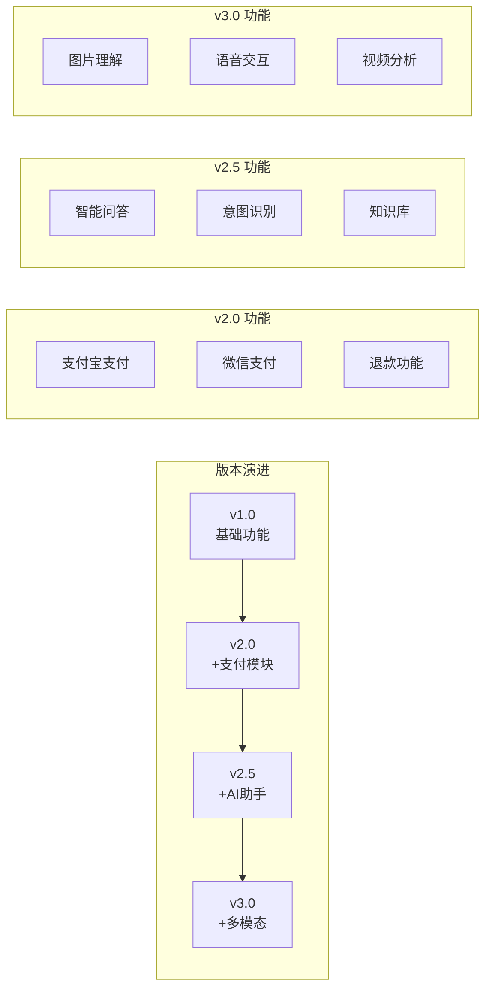

### 4.3 各阶段目标

| 阶段 | 版本 | 核心目标 | 预计完成时间 |
|------|------|---------|-------------|
| **Phase 1** | v2.0 | 支付闭环 | 2025-03 |
| **Phase 2** | v2.5 | AI助手上线 | 2025-05 |
| **Phase 3** | v3.0 | 多模态能力 | 2025-07 |

---

## 5. 风险评估与应对

### 5.1 支付模块风险

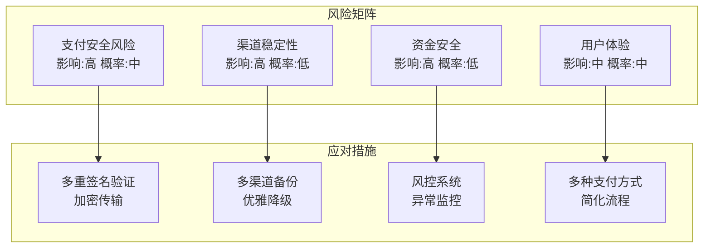

| 风险类型 | 风险描述 | 应对措施 |
|---------|---------|---------|
| **安全风险** | 支付数据泄露 | 1. 全链路HTTPS加密 2. 敏感信息脱敏存储 3. PCI DSS合规 |
| **稳定性风险** | 支付渠道故障 | 1. 多渠道冗余 2. 本地降级方案 3. 实时监控告警 |
| **合规风险** | 支付牌照要求 | 1. 接入持牌支付机构 2. 资金分账合规 3. 反洗钱机制 |

### 5.2 AI助手模块风险

| 风险类型 | 风险描述 | 应对措施 |
|---------|---------|---------|
| **内容风险** | AI生成不当内容 | 1. 内容审核过滤 2. 敏感词拦截 3. 人工审核机制 |
| **准确性风险** | 回答错误/幻觉 | 1. RAG增强准确性 2. 人工标注反馈 3. 置信度阈值控制 |
| **成本风险** | LLM调用成本高 | 1. 缓存热门问答 2. 小模型+大模型结合 3. 请求频率限制 |
| **合规风险** | 数据隐私合规 | 1. 数据本地化存储 2. 用户授权机制 3. 数据脱敏处理 |

---

## 6. 总结

### 6.1 功能全景图

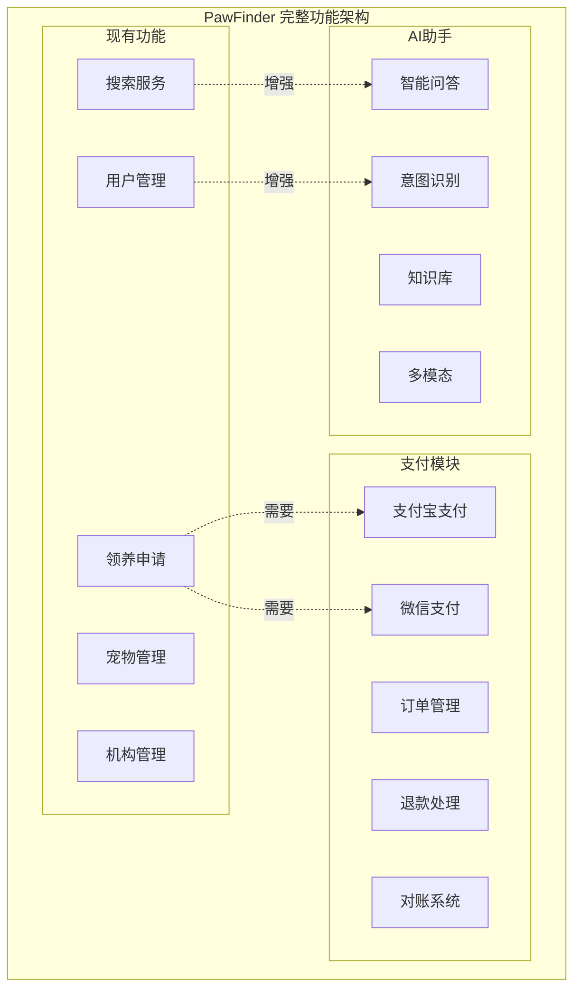

### 6.2 预期收益

| 模块 | 业务价值 | 技术价值 |
|------|---------|---------|
| **支付模块** | 完善商业闭环、支持多元化收入 | 分布式事务实践、支付安全能力 |
| **AI助手** | 提升用户体验、降低客服成本 | LLM应用实践、RAG技术积累 |

### 6.3 资源需求

| 阶段 | 人力投入 | 预算预估 |
|------|---------|---------|
| **支付模块** | 2人月 | ¥50,000（支付渠道接入费） |
| **AI助手基础版** | 3人月 | ¥80,000（LLM API费用/年） |
| **AI助手进阶版** | 4人月 | ¥150,000（向量库、GPU等） |

---

## 附录

### A. 相关文档

| 文档 | 路径 | 说明 |
|------|------|------|
| 系统设计文档 | `docs/SYSTEM-DESIGN.md` | 当前系统架构设计 |
| 系统实现文档 | `docs/SYSTEM-IMPLEMENTATION.md` | 当前系统实现细节 |
| API接口文档 | `docs/API-INTERFACE.md` | 前后端接口定义 |
| 数据库设计 | `docs/DATABASE.md` | 数据库表结构设计 |

### B. 参考资料

1. [支付宝开放平台文档](https://opendocs.alipay.com/)
2. [微信支付开发文档](https://pay.weixin.qq.com/wiki/doc/apiv3/wxpay/pages/index.shtml)
3. [LangChain官方文档](https://python.langchain.com/docs/)
4. [Milvus向量数据库文档](https://milvus.io/docs)

---

> 📝 **文档维护**：本文档将随项目进展持续更新，请定期关注最新版本。
