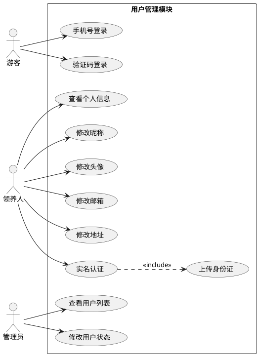
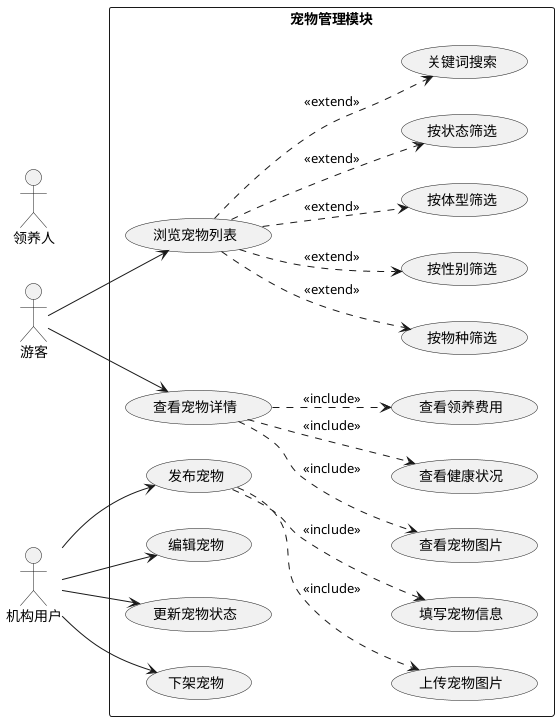
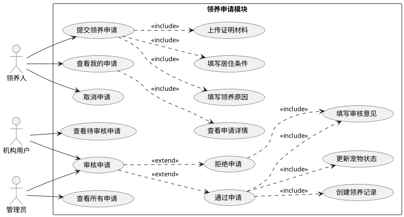
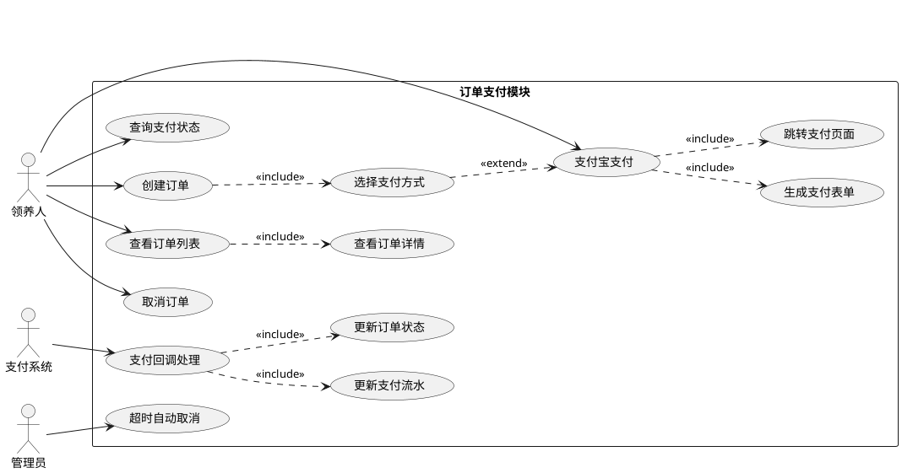
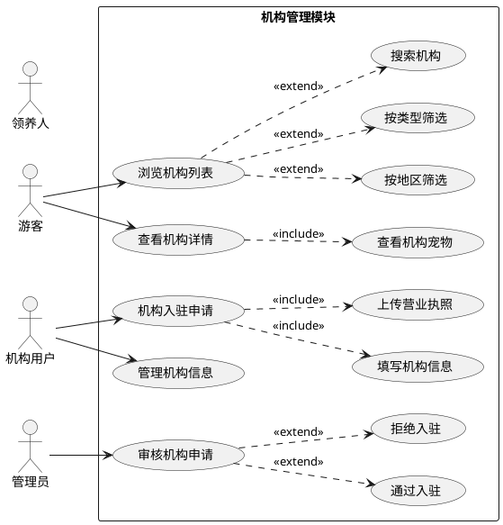

# PawFinder 用例图

> 本文档包含 PawFinder 宠物领养系统的完整用例图，使用 PlantUML 格式描述。

---

## 1. 系统概述

PawFinder 是一个宠物领养平台，连接领养人和救助机构，提供宠物信息展示、领养申请、在线支付等功能。

---

## 2. 参与者 (Actors)

| 参与者 | 说明 |
|--------|------|
| 游客 (Guest) | 未登录用户，可浏览宠物信息 |
| 领养人 (Adopter) | 已注册用户，可申请领养宠物 |
| 机构用户 (Institution) | 救助机构工作人员，可发布和管理宠物 |
| 管理员 (Admin) | 系统管理员，负责审核和平台管理 |
| 支付系统 (Payment System) | 支付宝支付系统，处理支付交易 |

---

## 3. 用例图

### 3.1 系统总体用例图

```plantuml
@startuml PawFinder系统用例图
left to right direction
skinparam packageStyle rectangle
skinparam actorStyle awesome

actor "游客" as Guest
actor "领养人" as Adopter
actor "机构用户" as Institution
actor "管理员" as Admin
actor "支付系统" as PaymentSystem

rectangle "PawFinder 宠物领养系统" {
    
    package "用户管理" {
        usecase "用户注册/登录" as UC_Register
        usecase "查看个人信息" as UC_ViewProfile
        usecase "修改个人信息" as UC_EditProfile
        usecase "实名认证" as UC_Verify
    }
    
    package "宠物管理" {
        usecase "浏览宠物列表" as UC_BrowsePets
        usecase "查看宠物详情" as UC_ViewPetDetail
        usecase "搜索宠物" as UC_SearchPets
        usecase "发布宠物信息" as UC_AddPet
        usecase "编辑宠物信息" as UC_EditPet
        usecase "下架宠物" as UC_RemovePet
    }
    
    package "机构管理" {
        usecase "浏览机构列表" as UC_BrowseInstitutions
        usecase "查看机构详情" as UC_ViewInstitution
        usecase "机构入驻申请" as UC_ApplyInstitution
        usecase "管理机构信息" as UC_ManageInstitution
    }
    
    package "领养申请" {
        usecase "提交领养申请" as UC_SubmitApplication
        usecase "查看我的申请" as UC_ViewMyApplications
        usecase "取消申请" as UC_CancelApplication
        usecase "审核领养申请" as UC_ReviewApplication
        usecase "查看所有申请" as UC_ViewAllApplications
    }
    
    package "订单支付" {
        usecase "创建订单" as UC_CreateOrder
        usecase "支付订单" as UC_PayOrder
        usecase "查看订单" as UC_ViewOrders
        usecase "取消订单" as UC_CancelOrder
        usecase "处理支付回调" as UC_PaymentCallback
    }
    
    package "系统管理" {
        usecase "用户管理" as UC_ManageUsers
        usecase "机构审核" as UC_ReviewInstitution
        usecase "数据统计" as UC_Statistics
    }
}

' 游客用例
Guest --> UC_BrowsePets
Guest --> UC_ViewPetDetail
Guest --> UC_SearchPets
Guest --> UC_BrowseInstitutions
Guest --> UC_ViewInstitution
Guest --> UC_Register

' 领养人继承游客
Adopter --|> Guest
Adopter --> UC_ViewProfile
Adopter --> UC_EditProfile
Adopter --> UC_Verify
Adopter --> UC_SubmitApplication
Adopter --> UC_ViewMyApplications
Adopter --> UC_CancelApplication
Adopter --> UC_CreateOrder
Adopter --> UC_PayOrder
Adopter --> UC_ViewOrders
Adopter --> UC_CancelOrder

' 机构用户继承领养人
Institution --|> Adopter
Institution --> UC_AddPet
Institution --> UC_EditPet
Institution --> UC_RemovePet
Institution --> UC_ManageInstitution
Institution --> UC_ViewAllApplications
Institution --> UC_ReviewApplication

' 管理员用例
Admin --> UC_ManageUsers
Admin --> UC_ReviewInstitution
Admin --> UC_Statistics
Admin --> UC_ViewAllApplications
Admin --> UC_ReviewApplication

' 支付系统
PaymentSystem --> UC_PaymentCallback

@enduml
```



---

### 3.2 用户管理模块用例图



---

### 3.3 宠物管理模块用例图



---

### 3.4 领养申请模块用例图



---

### 3.5 订单支付模块用例图



---

### 3.6 机构管理模块用例图



---

## 4. 用例描述表

### 4.1 核心用例描述

#### UC-001 提交领养申请

| 项目 | 描述 |
|------|------|
| 用例名称 | 提交领养申请 |
| 参与者 | 领养人 |
| 前置条件 | 用户已登录，宠物状态为"可领养" |
| 后置条件 | 创建申请记录，宠物状态变为"审核中" |
| 主成功场景 | 1. 领养人选择宠物<br>2. 填写领养原因<br>3. 填写居住条件<br>4. 上传证明材料<br>5. 提交申请 |
| 备选流程 | 3a. 用户已有该宠物的待审核申请：提示"您已申请过该宠物" |
| 业务规则 | 每个用户对同一宠物只能有一个未取消的申请 |

#### UC-002 审核领养申请

| 项目 | 描述 |
|------|------|
| 用例名称 | 审核领养申请 |
| 参与者 | 机构用户、管理员 |
| 前置条件 | 申请状态为"待审核" |
| 后置条件 | 申请状态变更，若通过则创建领养记录 |
| 主成功场景 | 1. 查看待审核申请列表<br>2. 查看申请详情<br>3. 审核通过/拒绝<br>4. 填写审核意见<br>5. 更新状态 |
| 备选流程 | 5a. 通过：创建领养记录，更新宠物状态为"已领养"<br>5b. 拒绝：宠物状态恢复为"可领养" |
| 业务规则 | 使用 Seata 分布式事务保证数据一致性 |

#### UC-003 支付订单

| 项目 | 描述 |
|------|------|
| 用例名称 | 支付订单 |
| 参与者 | 领养人、支付系统 |
| 前置条件 | 订单状态为"待支付"，订单未过期 |
| 后置条件 | 订单状态变更为"已支付" |
| 主成功场景 | 1. 领养人选择订单<br>2. 选择支付宝支付<br>3. 跳转支付宝页面<br>4. 完成支付<br>5. 支付宝回调通知 |
| 备选流程 | 4a. 支付取消：订单保持待支付状态<br>5a. 回调失败：系统主动查询支付状态 |
| 业务规则 | 订单24小时未支付自动取消 |

#### UC-004 发布宠物信息

| 项目 | 描述 |
|------|------|
| 用例名称 | 发布宠物信息 |
| 参与者 | 机构用户 |
| 前置条件 | 用户已登录且为机构用户 |
| 后置条件 | 宠物信息入库，状态为"可领养" |
| 主成功场景 | 1. 点击发布宠物<br>2. 填写宠物基本信息<br>3. 上传宠物图片<br>4. 填写健康状况<br>5. 提交发布 |
| 备选流程 | 2a. 必填项未填写：提示完善信息 |
| 业务规则 | 图片最多上传9张，支持 JPG/PNG 格式 |

---

## 5. 用例统计

### 5.1 按模块统计

| 模块 | 用例数量 | 说明 |
|------|----------|------|
| 用户管理 | 8 | 注册、登录、个人信息管理 |
| 宠物管理 | 12 | 浏览、搜索、发布、管理 |
| 机构管理 | 9 | 浏览、入驻、管理 |
| 领养申请 | 10 | 申请、审核、记录 |
| 订单支付 | 10 | 订单、支付、回调 |
| 系统管理 | 3 | 用户管理、机构审核、统计 |
| **合计** | **52** | - |

### 5.2 按参与者统计

| 参与者 | 用例数量 | 主要职责 |
|--------|----------|----------|
| 游客 | 7 | 浏览信息 |
| 领养人 | 12 | 申请领养、支付 |
| 机构用户 | 9 | 发布宠物、审核申请 |
| 管理员 | 6 | 平台管理 |
| 支付系统 | 1 | 支付回调 |

---

## 6. 用例关系说明

### 6.1 包含关系 (Include)

被包含的用例是基础用例执行的必要步骤。

```
查看宠物详情 <<include>> 查看宠物图片
查看宠物详情 <<include>> 查看健康状况
提交领养申请 <<include>> 填写领养原因
审核申请 <<include>> 填写审核意见
支付宝支付 <<include>> 生成支付表单
```

### 6.2 扩展关系 (Extend)

扩展用例在特定条件下执行。

```
浏览宠物列表 <<extend>> 按物种筛选
浏览宠物列表 <<extend>> 关键词搜索
审核申请 <<extend>> 通过申请
审核申请 <<extend>> 拒绝申请
选择支付方式 <<extend>> 支付宝支付
```

### 6.3 泛化关系 (Generalization)

子参与者继承父参与者的所有用例。

```
领养人 --|> 游客
机构用户 --|> 领养人
```

---

## 附录：PlantUML 渲染说明

### 在线渲染

将 PlantUML 代码复制到以下在线工具渲染：
- https://www.planttext.com/
- https://plantuml.com/zh/online

### 本地渲染

1. 安装 PlantUML 插件（VS Code / IntelliJ IDEA）
2. 安装 Java 运行环境
3. 打开 `.puml` 文件预览

### 导出格式

支持导出为：
- PNG 图片
- SVG 矢量图
- PDF 文档

---

> 文档版本: v1.0  
> 更新时间: 2025-04-22  
> 维护者: PawFinder 开发团队
